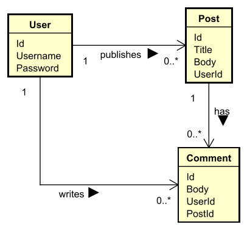

# DNP Forum Application

A simple forum application inspired by Reddit.

This project is developed as part of the 
Distributed Network Programming (DNP) 
course at VIA University College.

Made by: Magnus Forbes Kjær-Rasmussen

## Domain Model

## Technologies
- C#
- .NET
- Rider
- Git
- GitHub

## Assignments done (out of 7)

✓ Assignment 1: Entities & Repositories 

✓ Assignment 2: Command Line Interface

✓ Assignment 3: File Persistence