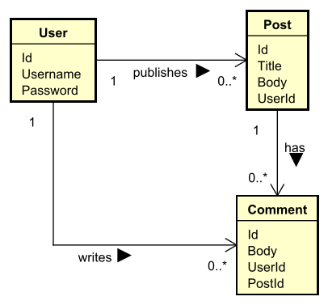

# DNP Forum Application

A simple forum application inspired by Reddit.

This project is developed as part of the 
Distributed Network Programming (DNP) 
course at VIA University College.

## How to run

Requires the [.NET 10 SDK](https://dotnet.microsoft.com/download).

```
dotnet run --project Server/CLI
```

Or in Rider, run the `CLI` project.

On first run, a `Data/` folder is created in the project root with seed data.

## Features

The CLI is navigated with the arrow keys. Every screen has a way back, and you can log out at any time to switch user.

- **Log in** as an existing user with password, or create a new user
- **Posts:** browse all posts, see your own, create, edit and delete your posts
- **Comments:** add comments to any post, edit and delete your own
- **Users:** browse and search users, view a user's posts and comments, change your username or password, delete your account

## Project structure

| Project | Responsibility |
|---|---|
| `Entities` | Domain classes: `User`, `Post`, `Comment` |
| `RepositoryContracts` | Repository interfaces |
| `InMemoryRepositories` | List based repositories (Assignment 1) |
| `FileRepositories` | JSON file repositories (Assignment 3) |
| `CLI` | Console UI, split into views per entity |

## Domain Model



## Technologies
- C#
- .NET
- [Spectre.Console](https://spectreconsole.net/)
- Rider
- Git
- GitHub

## Assignments done (out of 7)

✓ Assignment 1: Entities & Repositories 

✓ Assignment 2: Command Line Interface

✓ Assignment 3: File Persistence

## Author

Magnus Forbes Kjær-Rasmussen
